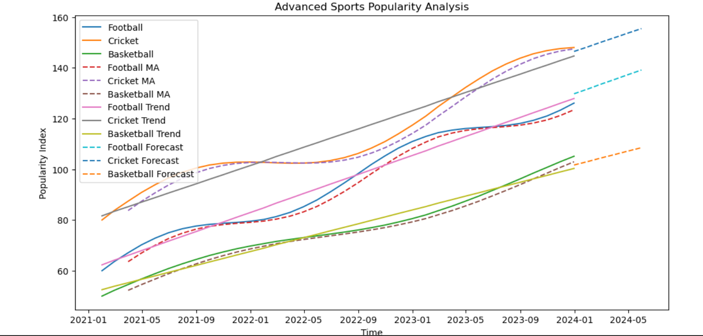
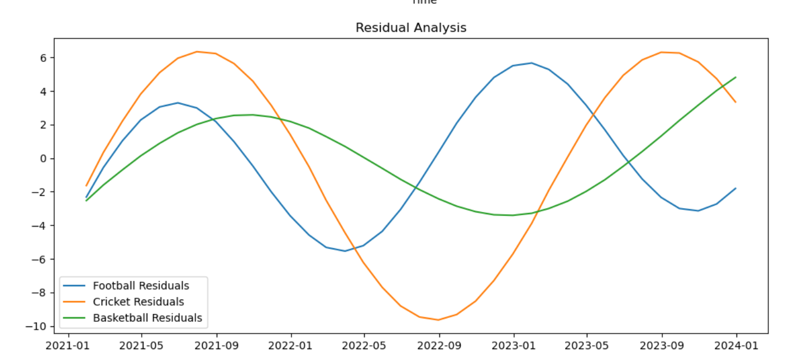

# 📊 Sports Popularity Time Series Analysis

## 📌 Project Overview
This project performs a **time series analysis** of sports popularity trends over time. It focuses on three sports:
- Football  
- Cricket  
- Basketball  

The analysis includes trend modeling, moving averages, residual analysis, and forecasting.

---

## 🎯 Objectives
- Analyze trends in sports popularity  
- Apply moving averages  
- Build regression models  
- Evaluate performance using R²  
- Forecast future values  
- Perform residual analysis  

---

## 🛠️ Technologies Used
- Python  
- Pandas  
- NumPy  
- Matplotlib  
- Scikit-learn  

---

## 📂 Dataset Description
- Monthly data (2021–2023)  
- Synthetic dataset with:
  - Trend  
  - Seasonality  

---

## ⚙️ Methodology

### 1. Moving Average
Used 3-period rolling mean to smooth the data.

### 2. Trend Line
Fitted using linear regression:
y = mx + c

### 3. Residual Analysis
Residuals = Actual − Predicted

### 4. Forecasting
Predicted next 6 months using trend.

---

## 📈 Visualizations

### 🔹 Advanced Sports Popularity Analysis

### 🔹 Residual Analysis

---

## 📊 Results
- Football shows strong upward trend  
- Cricket shows seasonal variation  
- Basketball shows steady growth  

---

## 📌 Conclusion
This project demonstrates:
- Time series smoothing  
- Trend modeling  
- Forecasting techniques  

It is useful for beginners in data analytics and time series.

---
